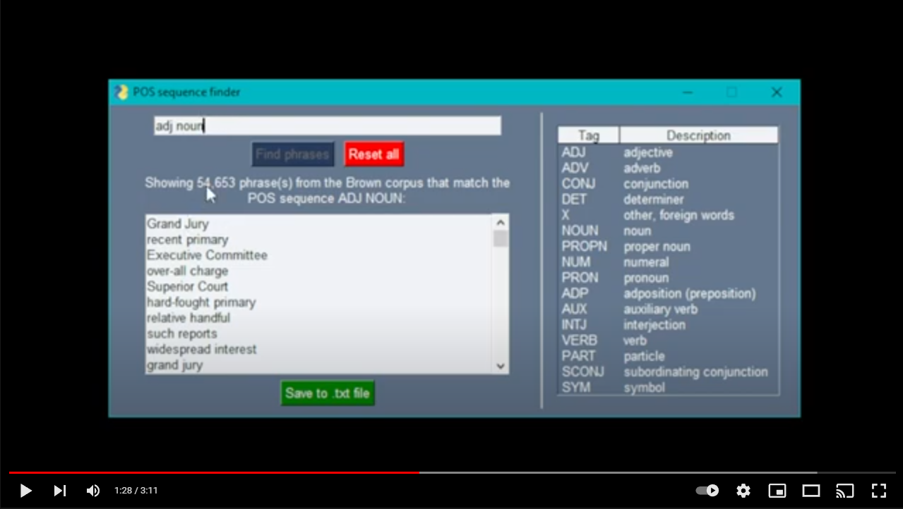

# POS Sequence Finder

POS Sequence Finder is a Windows desktop app that lets you find phrases in the Brown corpus that match given part of speech sequences.

## How to install

### Method 1

1. Download the ZIP archive **[POS-sequence-finder.zip](POS-sequence-finder.zip)**.
2. Extract all files to any folder on your computer.
3. Navigate to the folder and double click on the file **POS-sequence-finder.exe**.

### Method 2

1. Clone the repository.
2. Run the file **POS-sequence-finder.exe** in the **dist** folder.

## How to use

The UI is very simple and intuitive, so click around and work it out for yourself or watch the demo video on YouTube:

## About the code

The code is split into two Python files.

**[app.py](app.py)** is the program for the main app, which is built using the **[PySimpleGUI](https://pysimplegui.readthedocs.io/en/latest/)** library.

**[backend.py](backend.py)** contains backend functions for parsing user input, getting matches from the Brown corpus using the **[NLTK](https://www.nltk.org/)** library, and generating display strings.

