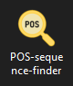

# POS Sequence Finder

POS Sequence Finder is a Windows desktop app that allows users to find phrases in the Brown corpus that match given part of speech sequences.

## How to install

### Method 1

1. Download the ZIP archive **[POS sequence finder.zip](POS sequence finder.zip)**.
2. Extract all files to any folder on your computer.
3. Navigate to the folder and double click on the file **POS sequence finder.exe**.

### Method 2

1. Clone the repository.
2. Run the file **[POS sequence finder.exe](dist/POS sequence finder.zip)** in the **dist** folder.

## How to use

(coming soon)

